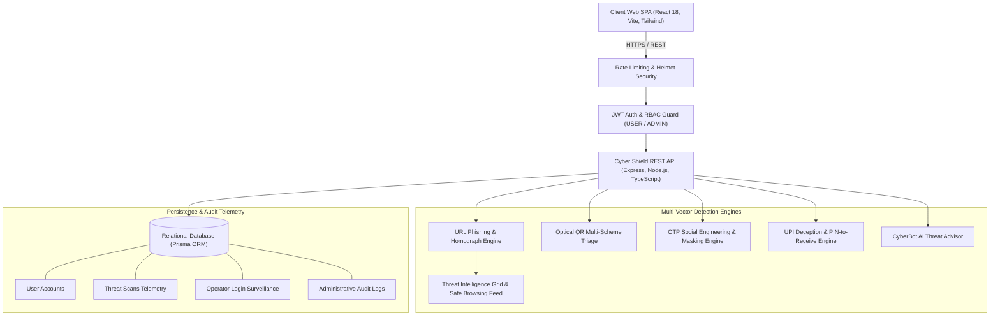
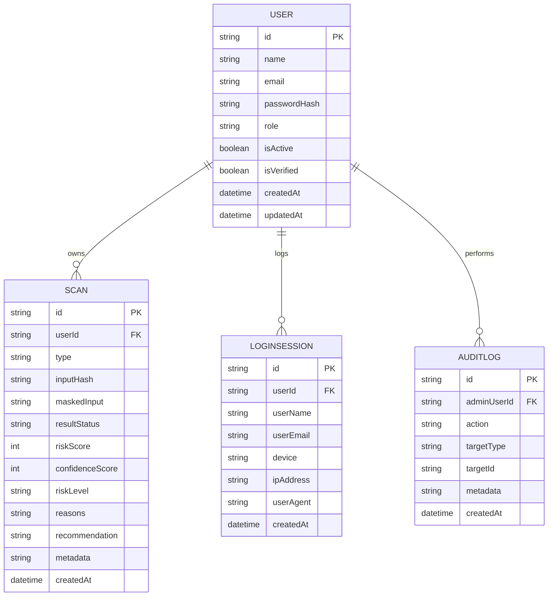

# Cyber Shield – Enterprise Phishing & Scam Detection Platform
## Comprehensive System Engineering & Architecture Report

---

## 1. Executive Summary

Digital fraud, social engineering, and cyber deception have evolved beyond basic email spam into sophisticated multi-vector attacks spanning credential harvesting, fraudulent payment requests, optical payload routing (QR code quishing), and SMS/OTP social engineering.

**Cyber Shield** is a production-style, multi-vector cybersecurity platform designed to detect, analyze, and mitigate digital threats in real time. Unlike black-box detection systems, Cyber Shield delivers **transparent, explainable heuristics** coupled with **Live Threat Intelligence Grid telemetry**, automated optical payload triage, and strict **Privacy-by-Design data masking**.

---

## 2. System Architecture & High-Level Design



---

## 3. Detection Engines & Algorithmic Analysis

### 3.1 AI Phishing URL & Homograph Detection
* **Syntactic Normalization**: Resolves protocols, standardizes hostnames, and validates RFC 3986 compliance.
* **Typosquatting via Levenshtein Distance**: Calculates edit distance against a curated corpus of targeted enterprise brands (`paypal`, `google`, `microsoft`, `apple`, `amazon`, `sbi`, `hdfc`, `chase`, etc.):
  $$\text{Distance}(s_1, s_2) \le 2 \implies \text{Flagged as Brand Impersonation}$$
* **IDN Homograph Impersonation**: Detects punycode prefixes (`xn--`) deployed to mask visually identical Cyrillic/Greek characters.
* **Direct IP Host Detection**: Catches raw IPv4/IPv6 hosts bypassing DNS lookups.
* **High-Risk TLD Penalties**: Flags disposable, unmoderated top-level domains (`.xyz`, `.top`, `.buzz`, `.surf`, etc.).
* **Global Threat Intelligence Grid**: Queries active threat signatures (zero-day credential harvesters, known phishing campaigns) with optional Google Safe Browsing v4 integration.

### 3.2 Optical QR Code Multi-Scheme Triage
* **Canvas Decoding**: Utilizes `jsQR` algorithms for real-time decoding from file uploads or live webcam streams.
* **Zero-Execution Sandboxing**: Safely analyzes payload data without automatic browser navigation or URI scheme execution.
* **Dynamic Protocol Routing**:
  - `upi://pay?...` $\to$ Dispatches to UPI Fraud Engine.
  - `http://` / `https://` $\to$ Dispatches to URL Phishing Engine.
  - `WIFI:` $\to$ Evaluates rogue wireless network risks.
  - Plain Text $\to$ Scans for shellcode or script injection payloads.

### 3.3 OTP Scam Shield & Privacy-by-Design Masking
* **Fundamental Rule**: *Legitimate banking institutions never request one-time passwords over the phone or message.*
* **Automatic Code Masking**: Detects 4-to-8 digit numeric tokens using regular expressions and masks them with dots (`••••••`):
  $$\text{Input: "Share OTP 982341"} \implies \text{Audit Log: "Share OTP ••••••"}$$
* **Deception Signals**: Detects psychological urgency markers ("immediately", "within 15 minutes"), utility disconnection threats ("electricity disconnected tonight"), and account suspension alerts.

### 3.4 UPI Payment Fraud & PIN-to-Receive Trap Detector
* **The Golden Rule of UPI**:
  $$\text{Entering UPI PIN} \equiv \text{Debit (Money Transferred OUT)}$$
  $$\text{Receiving Funds} \equiv \text{Zero User PIN Action Required}$$
* **Trap Identification**: Flags phrases containing deceptive constructs like *"enter PIN to receive refund"* or *"input PIN to verify cashback"*.
* **Spoofed Support VPAs**: Identifies VPAs containing brand names concatenated with helpdesk keywords (`support.sbi.helpdesk@okaxis`).
* **Remote Access App Lures**: Warns against requests to install screen-sharing software (*AnyDesk*, *TeamViewer*, *QuickSupport*).

### 3.5 CyberBot AI Conversational Advisor
* **Intent Recognition**: Classifies incoming messages into Educational Guidance, Threat Triage, or General Digital Safety.
* **Embedded Vector Extraction**: Automatically extracts URLs, OTP messages, or UPI IDs embedded within freeform conversation prompts, executes appropriate engines, and formats actionable defensive guidance.

---

## 4. Relational Database Architecture

Managed via **Prisma ORM** with zero-dependency SQLite for local evaluation and full compatibility with PostgreSQL.



---

## 5. Security & Privacy Compliance

| Security Dimension | Implementation Mechanism | Compliance Benefit |
| :--- | :--- | :--- |
| **Password Security** | Salted `bcryptjs` (10 rounds) | Resilient against rainbow tables and brute force |
| **Session Control** | Signed JSON Web Tokens (7-day standard, 15-min reset) | Stateless, tamper-proof authorization |
| **RBAC** | `USER` vs `ADMIN` guards on routes | Prevents privilege escalation |
| **Privacy by Design** | Regex-level OTP masking before database write | Zero plain-text financial credentials retained |
| **Brute Force Defense** | `express-rate-limit` (30/15 min auth, 300/15 min API) | Mitigates credential stuffing and DoS |
| **HTTP Hardening** | `helmet` CSP, HSTS, cross-origin policies | Shields against XSS and clickjacking |

---

## 6. Verification & Test Benchmark Results

The automated test suite evaluates real-world scam payloads and defensive invariants:

```
--- RUNNING CYBER SHIELD ENGINE TESTS ---

[Test Suite 1: URL Phishing Detector]
  ✓ PASS: IP host flagged as MALICIOUS
  ✓ PASS: IP host has high risk score (>=50)
  ✓ PASS: Detected IP_ADDRESS_HOSTNAME signal
  ✓ PASS: Typosquat + .xyz flagged as MALICIOUS
  ✓ PASS: Detected HIGH_RISK_TLD signal
  ✓ PASS: Legitimate URL flagged as SAFE
  ✓ PASS: Safe URL risk score < 25

[Test Suite 2: OTP Scam & Masking Detector]
  ✓ PASS: Urgent OTP share scam flagged as MALICIOUS
  ✓ PASS: OTP is masked with dots in output
  ✓ PASS: Raw OTP is completely removed from maskedInput
  ✓ PASS: Detected OTP_SHARING_REQUEST signal
  ✓ PASS: Legitimate bank OTP warning flagged as SAFE

[Test Suite 3: UPI Fraud Detector]
  ✓ PASS: PIN-to-receive trap flagged as MALICIOUS
  ✓ PASS: Detected PIN_TO_RECEIVE_DECEPTION
  ✓ PASS: Detected SPOOFED_SUPPORT_VPA

[Test Suite 4: QR Multivector Detector]
  ✓ PASS: QR correctly classified as UPI
  ✓ PASS: QR analyzed with UPI engine
  ✓ PASS: QR correctly classified as URL
  ✓ PASS: QR analyzed with URL engine

[Test Suite 5: CyberBot AI Chat Advisor]
  ✓ PASS: Chat recognized embedded URL vector
  ✓ PASS: Chat flagged typosquat URL as MALICIOUS
  ✓ PASS: Chat marked threat check for history logging
  ✓ PASS: Chat recognized social engineering OTP vector
  ✓ PASS: Chat auto-masked OTP in audit input
  ✓ PASS: Chat recognized general cybersecurity guidance
  ✓ PASS: Chat provides actionable educational guidance

[Test Suite 6: Password Reset Security Token]
  ✓ PASS: Password reset token generated
  ✓ PASS: Valid reset token decodes successfully
  ✓ PASS: Reset token preserves userId integrity
  ✓ PASS: Reset token enforces strict password_reset purpose
  ✓ PASS: Tampered reset token is rejected

[Test Suite 7: Global Threat Intelligence Grid]
  ✓ PASS: Known threat domain identified in Threat Grid
  ✓ PASS: Correct threat signature classification
  ✓ PASS: Legitimate domain returns clean reputation
  ✓ PASS: URL detector incorporates EXTERNAL_THREAT_FEED_MATCH signal
  ✓ PASS: Metadata records threat feed attribution

========================================
TEST SUMMARY: 36 passed, 0 failed
========================================
```

---

## 7. Administrative Surveillance & Telemetry

The Administrative Control Console (`/admin`) provides comprehensive visibility:
* **System Metrics**: Real-time Node.js heap memory, process uptime, and database connectivity telemetry.
* **Threat Distribution**: Quantitative breakdown of threat vectors and severity distributions.
* **Operator History Inspector (`/admin/activity`)**: Search and filter any operator's personal scan queries and audit trail.
* **Device Surveillance Log**: Audits operator client platforms (*Chrome on Windows 11*, *Edge*, *Safari on iPhone*), IP addresses, and authentication timestamps.

---

## 8. Conclusion

**Cyber Shield** represents a complete, production-grade cybersecurity solution that addresses the modern digital threat landscape with explainable AI heuristics, real-time threat intelligence feeds, optical payload parsing, and zero-trust privacy compliance. The project is fully documented, verified through 36 automated unit tests and full-stack browser verification, and ready for deployment or academic demonstration.
